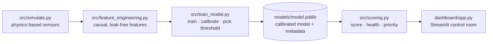
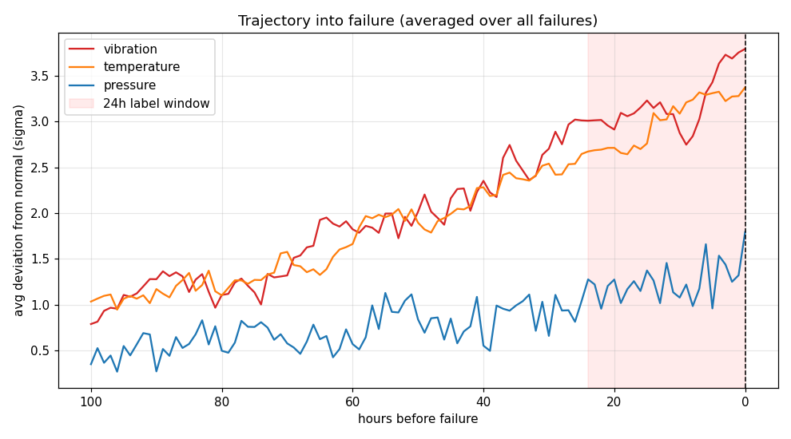
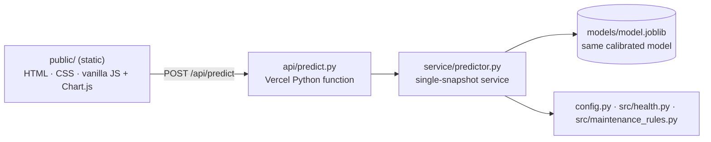

# ☕ Coffee Line — Predictive Maintenance

Predictive-maintenance system for a simulated coffee-production line. For every
machine on the line it estimates the probability of a failure within the next
**24 operating hours**, turns that probability into a calibrated risk score, a
transparent 0–100 health score and a maintenance-priority ranking, and serves
the whole thing through a retro-arcade **Streamlit** control room — with
**SHAP** explaining every individual prediction.

The sensor data comes from a physics-based simulator that ships with the repo,
so the project is fully self-contained: clone it, generate the data, train the
model and launch the dashboard in four commands. No real plant, hardware or
external data is required.

> The production line, the sensors and the failures are all synthetic —
> generated by `src/simulate.py` with a fixed seed. This is an end-to-end ML
> engineering portfolio project, not a deployment against physical equipment.

---

## Highlights

- **End-to-end pipeline** — synthetic sensor generation → leak-free feature
  engineering → time-aware training + calibration → live scoring → operator
  dashboard, each stage isolated in its own module.
- **Honest evaluation** — a purged chronological split with a 24-hour gap,
  probability calibration, a recall-favouring decision threshold, PR-AUC-led
  metrics for the rare-event target, and explicit leakage proofs.
- **Explainable** — per-machine SHAP breakdowns show which sensors pushed a
  prediction toward or away from failure.
- **Decision-ready** — a rule-based health score and an expected-loss priority
  queue turn raw probabilities into "fix *this* machine first".
- **Reproducible** — a fixed random seed means the dataset and the trained
  model rebuild identically on any machine.

---

## How it works

The system is a straight pipeline — each stage is a module that hands a tidy
artifact to the next, so the dashboard can never score a machine differently
from how the model was trained and evaluated.



1. **Simulate** a 6-month hourly sensor history for a 13-machine line and label
   the 24 hours before each failure.
2. **Engineer** past-only features (rates of change, rolling stats, deviation
   z-scores, interactions) that never peek into the future.
3. **Train** three candidate models on a time-ordered split, calibrate the
   winner's probabilities, and choose an alert threshold that favours recall.
4. **Score** any dataset through the exact same feature code + saved model, then
   layer on a health score, a plain-language recommendation and a priority rank.
5. **Serve** it all in a Streamlit dashboard with a line overview, a per-machine
   detail view (including SHAP) and a priority queue.

---

## Tech stack

| Area | Tools |
|------|-------|
| Language | Python 3.13 |
| Data wrangling | pandas 2.2.3, NumPy 2.1.3 |
| Modelling | scikit-learn 1.5.2 (LogisticRegression, RandomForest, calibration, metrics), XGBoost 2.1.3 |
| Explainability | SHAP 0.46.0 |
| Dashboard | Streamlit 1.40.2, Plotly 5.24.1 |
| Analysis / plots | matplotlib 3.9.2, seaborn 0.13.2 |
| Model persistence | joblib 1.4.2 |
| Testing | pytest 8.3.3 |

All versions are pinned. Deployment uses a lean subset —
[`requirements.txt`](requirements.txt) (numpy, scipy, scikit-learn, joblib) is
all the Vercel serverless function needs; the full local/training/dashboard set
lives in [`requirements-dev.txt`](requirements-dev.txt). See
[Vercel Deployment](#vercel-deployment).

## Project structure

```
product-maintenance/
├── config.py                     # single source of truth: machines, baselines, paths, thresholds
├── requirements.txt              # LEAN deps for the Vercel serverless function
├── requirements-dev.txt          # FULL deps: training, dashboard, notebooks, tests
├── vercel.json                   # Vercel build + routing (static frontend + Python API)
├── .vercelignore                 # keeps dev/data/dashboard out of the deployment
├── .env.example                  # no secrets required — documents that + optional PORT
├── src/
│   ├── simulate.py               # physics-based sensor simulator + failure labelling
│   ├── feature_engineering.py    # causal (leak-free) feature matrix — 23 features
│   ├── train_model.py            # time-aware split, 3 models, calibration, threshold, leakage proofs
│   ├── health.py                 # transparent 0–100 health score (rule-based, no ML)
│   ├── maintenance_rules.py      # plain-language maintenance recommendations
│   ├── priority.py               # expected-units-lost ranking (risk × impact)
│   └── scoring.py                # glue: raw CSV → features → model → health → priority
├── service/
│   └── predictor.py              # single-snapshot prediction service (reuses model + config + src)
├── api/
│   └── predict.py                # Vercel Python serverless function: POST /api/predict
├── public/                       # static web frontend (served by Vercel)
│   ├── index.html                # dashboard markup
│   ├── styles.css                # responsive dark "control-room" theme
│   └── app.js                    # form → fetch /api/predict → gauges & charts (Chart.js)
├── local_server.py               # dev-only: serves public/ + /api/predict from one process
├── dashboard/
│   ├── app.py                    # Streamlit control room (3 tabs + sidebar)
│   └── theme.py                  # retro-arcade CSS skin (presentation only)
├── tests/
│   └── test_features.py          # causality / leakage unit tests
├── models/
│   └── model.joblib              # calibrated model + base model + feature list + threshold + metrics
├── screenshots/
│   └── trajectory_into_failure.png
├── notebooks/                    # (placeholder for exploratory analysis)
├── data/                         # generated CSVs land here (git-ignored)
└── .streamlit/config.toml        # dark base theme
```

---

## The machine learning, in detail

### 1. Simulated sensor data — `src/simulate.py`

A physics-flavoured simulator generates an hourly history for **13 machines
across 6 types** (Roaster, Grinder, Extraction, SprayDryer, Conveyor,
Packaging) over a 6-month horizon. Each reading (temperature, vibration,
pressure, rpm, motor current) is built from a per-type healthy baseline plus:

- an **AR(1) wobble** so consecutive readings are correlated, not white noise;
- a **daily ambient temperature cycle**;
- a **wear curve** that degrades a machine as `hours_since_maintenance` grows;
- occasional **fault modes** (`bearing`, `overheat`, `pressure`) that bend the
  relevant sensors before a failure;
- a **noisy failure threshold** and repair cycles that reset wear.

`add_failure_window_label` then marks the **24 rows before each failure** as the
positive class (`failure_within_window = 1`). The positive rate is tuned to a
realistic **3–8 %**, which is why every downstream choice is built for
imbalanced, rare-event data. Run `python -m src.simulate` to (re)build
`data/raw/sensor_data.csv`.

### 2. Feature engineering — `src/feature_engineering.py`

The target is "will this machine fail in the next 24 h", so features must use
**only the past**. Every transform is grouped by `machine_id` and looks
backward:

- **rates of change** — `.diff()` over 1 h and 6 h (temperature, vibration,
  pressure);
- **rolling statistics** — trailing 6-hour mean and std (temperature,
  vibration, machine load);
- **deviation z-scores** — how far each sensor sits from its per-type baseline;
- **interactions** — e.g. `temp_x_load`, `vibration_x_rpm`, `pressure_x_load`.

That yields a **23-column feature matrix**. Warm-up rows without enough history
(fewer than 7 hourly readings) are dropped so no feature is ever computed from
missing look-back. The causality of these features is enforced by unit tests
(see below).

### 3. Model training & calibration — `src/train_model.py`

Training is deliberately **time-aware**, because a random split would let the
model peek across the 24-hour label window and score unrealistically well:

- **Purged chronological split** — the first 70 % of hours train, the rest
  tests, with a **24-hour purge gap** removed at the boundary so no test label
  overlaps a training row. A slice of the training data is held out for
  calibration and threshold tuning.
- **Three candidates** — `LogisticRegression` (scaled, class-weighted),
  `RandomForestClassifier`, and `XGBClassifier` (with `scale_pos_weight` and
  `aucpr` eval). The winner is the one with the best **validation PR-AUC** —
  the right metric when positives are rare.
- **Probability calibration** — the winner is wrapped in
  `CalibratedClassifierCV` (isotonic, `cv="prefit"`) so a predicted "0.8" really
  means roughly an 80 % chance.
- **Recall-favouring threshold** — the alert cut-off is chosen by maximising
  **F-beta (β = 2)**: in maintenance, a missed failure costs far more than a
  false alarm.
- **Leakage proofs** — a shuffled-label run must collapse to baseline, and the
  random-vs-time-split gap is reported, so the headline score is trustworthy.

The result is saved as a single bundle, `models/model.joblib`, containing the
calibrated model, the raw base model (for SHAP), the feature list, the chosen
threshold, the model name and the test metrics. Run with
`python -m src.train_model`.

### 4. Scoring & insights — `scoring.py`, `health.py`, `maintenance_rules.py`, `priority.py`

`src/scoring.py` is the shared glue that both the dashboard and any batch job
use. `score_history` rebuilds features with the **same** code and attaches the
model's `failure_probability`; `latest_snapshot` reduces that to one row per
machine and enriches it with:

- **Health score** (`health.py`) — a transparent **0–100** score derived purely
  from sensor-deviation and overdue-maintenance penalties, *independent* of the
  ML probability, so operators get a second, explainable signal.
- **Recommendation** (`maintenance_rules.py`) — a plain-language headline and
  action, informed by the worst-deviating sensor and the SHAP top driver.
- **Priority** (`priority.py`) — ranks machines by **expected units lost =
  P(failure) × (units/hour × downtime hours)**, chasing the biggest
  risk-weighted production loss rather than the highest probability alone.

`compute_shap` (SHAP `TreeExplainer`) normalises SHAP's output across library
versions and returns per-feature contributions for the detail view.
`validate_raw` and `make_template_csv` let a user safely score their **own** CSV.

### 5. Dashboard — `dashboard/app.py`

A Streamlit "control room" ties it together. It runs **no ML of its own** — it
loads the saved bundle and calls `src/scoring.py`, so what you see is exactly
what was trained and evaluated. Results are cached (`st.cache_resource` for the
model, `st.cache_data` keyed on the CSV bytes) so moving the time slider never
forces a re-score.

- **Sidebar** — pick built-in simulated data or upload your own CSV (with a
  downloadable template and friendly validation), a "control-room clock" slider
  to replay any past hour of the simulation, and the live model facts
  (name, threshold, recall / precision / PR-AUC).
- **🏭 Line overview** — the line drawn stage by stage, each machine a card
  coloured by health band, with a pulsing light when a 24-hour failure is
  predicted.
- **🔎 Machine detail** — current readings, the health verdict, a recommendation,
  a **SHAP** bar chart of what drove the prediction, and 72-hour trend charts of
  sensor deviation and failure probability.
- **🚨 Priority queue** — the expected-units-lost ranking of what to fix first.

`dashboard/theme.py` is presentation only: it injects a retro-arcade CSS skin
(neon-on-navy palette, animations behind `prefers-reduced-motion`) without ever
touching the numbers.



---

## Getting started

**Prerequisites:** Python 3.13 (the commands below use `py -3.13`; adjust for
your platform's launcher).

```bash
# 1. create & activate a virtual environment
py -3.13 -m venv .venv
source .venv/Scripts/activate      # Windows (Git Bash); use .venv/bin/activate on macOS/Linux

# 2. install dependencies
pip install -r requirements.txt

# 3. build the pipeline
python -m src.simulate             # writes data/raw/sensor_data.csv
python -m src.train_model          # writes models/model.joblib

# 4. launch the dashboard
streamlit run dashboard/app.py
```

A trained `models/model.joblib` is already committed, so you can jump straight
to `streamlit run dashboard/app.py` — the dashboard will regenerate the raw CSV
from the seeded simulator on first run if it's missing.

## Vercel Deployment

The same trained model is also served as a **modern web app on Vercel** — a
static frontend plus a Python serverless function — so it can be deployed
straight from GitHub with no server to manage. This runs **alongside** the
Streamlit dashboard above; neither replaces the other, and the ML code is
untouched.

**Architecture.** The browser posts one machine snapshot to a Python serverless
function, which reuses the *exact* trained bundle and feature logic and returns
a real prediction — no placeholder or random numbers anywhere.



- **Frontend** — [`public/`](public/): a responsive dark dashboard (no build
  step, no framework). It builds the sensor form, calls the API, and renders the
  probability/health gauges and sensor-deviation chart with Chart.js (loaded
  from a CDN; it degrades gracefully to numeric/table readouts if the CDN is
  blocked).
- **API** — [`api/predict.py`](api/predict.py): a thin HTTP layer that does no ML
  of its own. It validates input and delegates to
  [`service/predictor.py`](service/predictor.py), which loads the trained bundle
  once per warm instance (never per request) and scores the snapshot with the
  same features, health score and recommendation rules as the Streamlit app.
- **Why a single-snapshot service?** The model was trained on time-series
  *history* features. A web form sends one reading, so the service synthesises
  the correct steady-state feature vector (rate-of-change and rolling-std = 0,
  rolling mean = the reading) and computes z-scores/interactions identically to
  `src/feature_engineering.py`. `machine_load` is converted from the form's
  percent (0–100) to the training fraction (0–1).

### API — `POST /api/predict`

Send a JSON body. The six sensor fields are **required**; the rest are optional
and fall back to healthy, documented defaults (so the minimal request from the
brief scores as-is).

```jsonc
// request
{
  "machine_type": "Grinder",   // optional (default "Grinder"); one of the 6 types
  "temperature": 75,            // required  (°C)
  "vibration": 4.2,             // required  (mm/s)
  "pressure": 8.5,              // required  (bar)
  "rotational_speed": 1500,     // required  (rpm)
  "operating_hours": 4200,      // required  (h)
  "machine_load": 72,           // required  (percent, 0–100)
  "motor_current": 30,          // optional  (A; default = type baseline)
  "hours_since_maintenance": 0, // optional  (default 0)
  "maintenance_count": 0,       // optional  (default 0)
  "previous_failures": 0        // optional  (default 0)
}
```

```jsonc
// response
{
  "failure_probability": 0.0973,          // calibrated P(failure within 24h)
  "health_score": 30,                     // transparent 0–100 score
  "risk_level": "Low",                    // Low | Medium | High | Critical
  "recommendation": "…plain-language action…",
  "details": { /* thresholds, per-sensor z-scores, model metrics, echoed inputs */ }
}
```

Errors are clean JSON: **400** for bad input/JSON, **503** if the model can't be
loaded, **500** for anything unexpected — the message is generic and the full
traceback is logged server-side, never returned. `GET /api/predict` returns a
short usage note and the list of valid machine types.

> **Security note:** the endpoint is **public and unauthenticated** (there are
> no secrets or user data — it only scores a synthetic-machine snapshot). That
> is fine for a portfolio demo, but if you fork this for anything real, add
> authentication and rate-limiting in front of `/api/predict`.

### Run and test the web app locally

You do **not** need the Vercel CLI to test locally — `local_server.py` serves
the static frontend and the `/api/predict` endpoint from one process, reusing
the exact serverless code, so a local prediction is identical to production.

**1. Install dependencies.** The web app needs only the lean deployment set:

```bash
py -3.13 -m venv .venv
source .venv/Scripts/activate      # Windows (Git Bash); .venv/bin/activate on macOS/Linux
pip install -r requirements.txt
```

**2. Run it locally.** A trained `models/model.joblib` is already committed:

```bash
python local_server.py             # serves http://localhost:8000
```

Open <http://localhost:8000>, pick a machine, and press **Predict failure
risk**. "Reset to healthy" refills the form with that machine type's baseline.

**3. Test the API directly** (in a second terminal):

```bash
curl -X POST http://localhost:8000/api/predict \
  -H "Content-Type: application/json" \
  -d '{"temperature":75,"vibration":4.2,"pressure":8.5,"rotational_speed":1500,"operating_hours":4200,"machine_load":72}'
```

You should get a JSON body with `failure_probability`, `health_score`,
`risk_level` and `recommendation`.

### Deploy to Vercel from GitHub

**4. Push to GitHub.**

```bash
git add .
git commit -m "Add Vercel web app (static frontend + Python API)"
git push origin main
```

**5. Import the repo into Vercel.** Sign in at
[vercel.com](https://vercel.com) → **Add New… → Project** → import your GitHub
repo. Vercel auto-detects [`vercel.json`](vercel.json); leave the build settings
at their defaults (the config already defines the static build and the Python
function, and bundles `models/`, `config.py`, `src/` and `service/` with the
function via `includeFiles`).

**6. Environment variables.** **None are required** — there are no secrets, keys
or credentials. `.env.example` documents this (only an optional `PORT` for the
local dev server, which Vercel ignores). You can deploy without setting anything.

**7. Deploy.** Click **Deploy**. Vercel installs `requirements.txt`, builds the
function and publishes the static frontend. The first cold start loads the model
once, then caches it on the warm instance.

**8. Test the production API** (swap in your deployment URL):

```bash
curl -X POST https://YOUR-PROJECT.vercel.app/api/predict \
  -H "Content-Type: application/json" \
  -d '{"machine_type":"Grinder","temperature":78,"vibration":9.5,"pressure":1.4,"rotational_speed":1360,"operating_hours":4200,"machine_load":92,"hours_since_maintenance":480}'
```

**9. Test the production dashboard.** Open `https://YOUR-PROJECT.vercel.app/` in
a browser, submit a reading, and confirm the gauges, risk banner, recommendation
and sensor-deviation chart update. Every push to `main` triggers an automatic
redeploy.

> **Runtime notes.** The function stays well under Vercel's 250 MB limit
> (numpy + scipy + scikit-learn + joblib only). Python 3.12 is a safe runtime;
> the pinned versions match those the model was serialised with, so it loads
> without estimator-version warnings.

## Testing & integrity checks

```bash
python -m pytest -q
```

`tests/test_features.py` guards the properties that make the model trustworthy:
that features use no look-ahead (early-row values are unchanged when future
hours are appended), that rate features really are simple differences, that the
label never leaks into the feature set, and that a z-score is zero at baseline.
On top of that, `train_model.py` runs its own leakage proofs at train time.

## Scalability & where it goes next

The design keeps the door open to a real deployment:

- **Stateless scoring** — `score_history` / `latest_snapshot` are pure
  functions of `(dataframe, bundle)`, so the same code runs as an interactive
  dashboard, a scheduled batch job, or behind a thin API with no changes.
- **Portable model** — the entire model is one `joblib` bundle, easy to version,
  ship or load anywhere.
- **Config-driven** — machines, baselines, health bands and production impacts
  all live in `config.py`; adding a machine type is a config entry, not a code
  change, and the z-score features pick it up automatically.
- **Vectorised features** — per-machine `groupby` transforms scale to many more
  machines and rows without per-row Python loops.
- **Bring-your-own-data** — the validated CSV-upload path already lets the
  trained model score arbitrary datasets in the same shape.

Natural next steps would be to swap the simulator for a real historian or
streaming source, schedule batch scoring, add model-registry versioning, and
monitor feature/prediction drift in production.

## A note on the data

All sensor readings, machines and failures are **synthetic**, produced by
`src/simulate.py`. The production-impact figures used in the priority ranking
are illustrative placeholders defined in `config.py`. The goal is to demonstrate
a complete, honest, explainable predictive-maintenance workflow end to end.

_Status: work in progress — phases are being built up incrementally._
